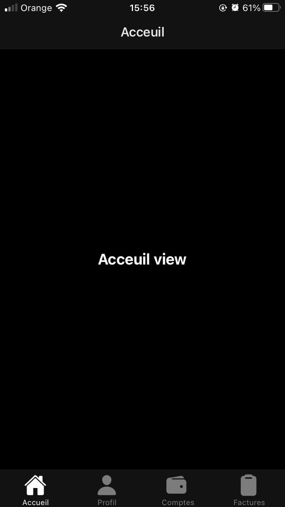

# CLIENT FRONTEND MOBILE #


### What is this repository for? ###

* Mobiel Frontend for Client.

### Requirments ###
* Install [Expo](https://expo.io/)
* For mobile install from Play Store/ App store

### How do I get set up? ###

* Clone your project
```sh
$ git clone git clone https://vvoox@bitbucket.org/ensapay-project/ensapay-client-mobile.git
$ cd ensapay-client-mobile
$ yarn install
$ yarn start
```
*In Case you don't have yarn use npm or install it from [Yarn](https://classic.yarnpkg.com/en/docs/install/#debian-stable).



